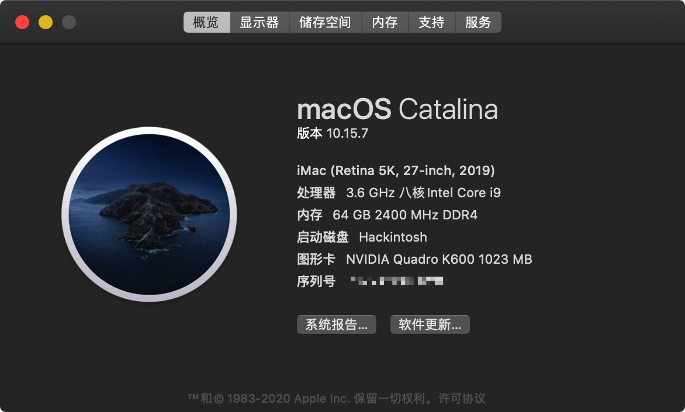

# MyHackintosh
> A Hackintosh repository for lzwang. I like macOS Catalina with Clover rather than BigSur with OpenCore, and the following are my config and EFI.

## Screenshot




## Hardware List

1. Motherboard: [Gigabyte Z390 Aorus Master](https://www.gigabyte.com/Motherboard/Z390-AORUS-MASTER-rev-10#kf)
2. CPU: [Intel® Core™ i9-9900K](https://ark.intel.com/content/www/us/en/ark/products/186605/intel-core-i9-9900k-processor-16m-cache-up-to-5-00-ghz.html)
3. GPU: [NVIDIA Quadro K600](https://www.techpowerup.com/gpu-specs/quadro-k600.c1839)
4. RAM: [Corsair Vengeance LPX 16GB * 4](https://www.corsair.com/us/en/Categories/Products/Memory/VENGEANCE-LPX/p/CMK16GX4M2B3200C16)
5. SSD: [Samsung 970 EVO 250GB](https://www.samsung.com/semiconductor/minisite/ssd/product/consumer/970evo/)
6. Power: [Seasonic Focus GX-1000W](https://seasonic.com/focus-gx)
7. Monitor: [Dell U2718Q](https://www.dell.com/si/business/p/dell-u2718q-monitor/pd)

## Software List

1. macOS: macOS Catalina 10.15.7(19H15)
2. Clover: 5107
3. Clover Configuator: 5.18.0.0
4. Clover theme: Material

## How to Disable macOS updates?

### 1. Disable auto update

(Apple Logo) -> System Preference -> Software Update -> **Uncheck** "Keep my mac up to date"

### 2. Kill finder to remove red dot for update

```shell
defaults write com.apple.systempreferences AttentionPrefBundleIDs 0
Killall Dock
```

### 3. Block network access

```shell
sudo vi /etc/hosts
```

Insert the following text:

```shell
127.0.0.1 swscan.apple.com
127.0.0.1 swcdn.apple.com
127.0.0.1 swdist.apple.com
```

### 4. Change permission for system-updater

1. Reboot your hackintosh to recoveryOS.
2. Open `Utilities -> Terminal` and do as followings.

```shell
# your_hackintosh_volume like “Macintosh HD” -> /Macintosh\ HD
cd /Volumes/${your_hackintosh_volume}

# change system updater permission
chmod 644 System/Library/PrivateFrameworks/SoftwareUpdate.framework/Versions/A/Resources/SoftwareUpdateNotificationManager.app/Contents/MacOS/SoftwareUpdateNotificationManager

# clear update files
rm -rf Library/Updates/
```

Reboot your hackintosh.

**Note**: If you want to install some tools (like xcode tools), just remove the three lines in step 3 in file `/etc/hosts`.

## Reference

1. EFI Config Source (modified): <https://github.com/cmer/gigabyte-z390-aorus-master-hackintosh>
2. Clover download: <https://sourceforge.net/projects/cloverefiboot/>
3. Clover Configuator download: <https://mackie100projects.altervista.org/download-clover-configurator/>
4. Clover themes collection (GitHub): <https://github.com/CloverHackyColor/CloverThemes>
5. Clover themes collection (Facebook):  <https://www.facebook.com/notes/hackintosh-indonesia/clover-themes-gallery/10155245189403649/>
6. Disable macOS Catalina updates (Chinese): <https://sysin.org/article/Disable-macOS-Update/>
